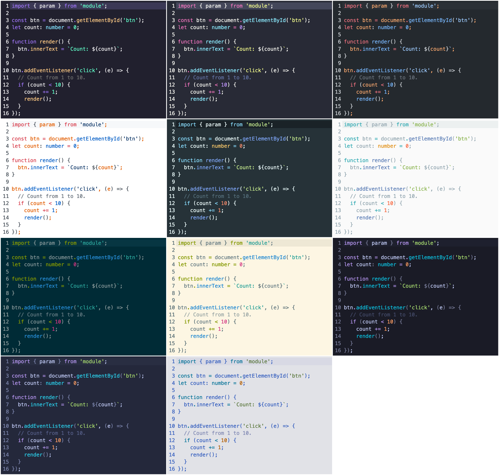

# Codemirror 6 Themes

Not perfect themes for cm6, generated from vscode themes.



## Install

```bash
npm i @ddietr/codemirror-themes
```

## Usage

```javascript
import {materialLight} from '@ddietr/codemirror-themes/material-light'
import {materialDark} from '@ddietr/codemirror-themes/material-dark'
import {solarizedLight} from '@ddietr/codemirror-themes/solarized-light'
import {solarizedDark} from '@ddietr/codemirror-themes/solarized-dark'
import {dracula} from '@ddietr/codemirror-themes/dracula'
import {githubLight} from '@ddietr/codemirror-themes/github-light'
import {githubDark} from '@ddietr/codemirror-themes/github-dark'
import {aura} from '@ddietr/codemirror-themes/aura'
import {tokyoNight} from '@ddietr/codemirror-themes/tokyo-night'
import {tokyoNightStorm} from '@ddietr/codemirror-themes/tokyo-night-storm'
import {tokyoNightDay} from '@ddietr/codemirror-themes/tokyo-night-day'
```

## Dev

```
# Start devserver with examples
npm run dev
```

## Build

```bash
go build
./codemirror-themes
npm i
```
